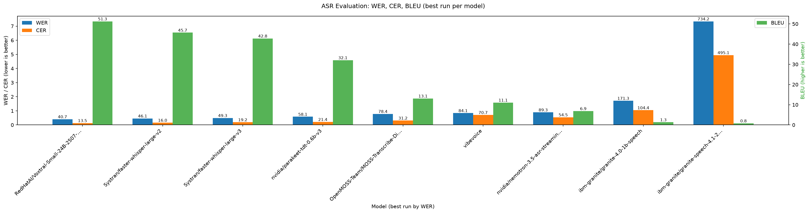

<div align="center">
    <h1 align="center">Serving FasterWhisper with BentoML</h1>
</div>

## What this service does

This is a self-hosted speech-to-text API for audio and meeting recordings. Send it an audio
file (any format FFmpeg can decode) and it returns an accurate transcript with word-level
timestamps. On top of plain transcription it offers:

- **Speaker diarization** — who spoke when. Every returned segment and word is labeled with a
  speaker, so you get a readable "Speaker 1 / Speaker 2" transcript, not just a wall of text.
  On by default; set `diarization=false` to skip it.
- **Multi-language handling** — meetings where people switch languages (even mid-sentence) are
  transcribed per speaker turn in the right language, instead of forcing one language over the
  whole file.
- **OpenAI-compatible endpoints** — it speaks the `/v1/audio/transcriptions` API, so existing
  OpenAI SDK clients and tooling work against it with just a URL change.

Response formats range from plain text to `verbose_json` and `json_diarized` (with per-segment
language and speaker).

### Models used

| Purpose | Model |
| --- | --- |
| Transcription | [faster-whisper](https://github.com/SYSTRAN/faster-whisper) `large-v2` (fast CTranslate2 Whisper) |
| Speaker diarization | [pyannote](https://github.com/pyannote/pyannote-audio) `speaker-diarization-community-1` |
| Voice activity (fallback) | Silero VAD, only when diarization is off |
| Language identification | Whisper's own per-turn language detection |

All models run locally — no data leaves your infrastructure. The Whisper model and (with an
`HF_TOKEN`) the pyannote weights are baked into the Docker image, so the first request is fast.

### Why `large-v2` (Swiss German benchmark)

`large-v2` is our preferred transcription model for **Swiss German**. On our internal test
bench we compared several ASR models (WER and CER lower is better, BLEU higher is better):



`RedHatAI/Voxtral-Small-24B` scores nominally better on all three metrics, but we still prefer
`faster-whisper-large-v2` because Voxtral is a **24B** model — far larger and much slower to
serve — and it is an **LLM that rewrites/corrects grammar on the fly**, so its scores partly
reflect that cleanup rather than faithful transcription. Among the practical, self-hostable
speech models, `large-v2` is the strongest on Swiss German while staying fast enough for
production.


## Prerequisites

- If you want to test the project locally, install FFmpeg on your system.
- Install the package manager uv ([docs](https://docs.astral.sh/uv/getting-started/installation/)).
- Python 3.13 is recommended.

## Install dependencies

```bash
git clone https://github.com/DCC-BS/bentoml-faster-whisper.git
cd bentoml-faster-whisper

uv sync
```

## Run the BentoML Service

We have defined a BentoML Service in `service.py`. Use uv to start the service in your project directory:

```bash
uv run bentoml serve service:FasterWhisper
```

2024-01-18T09:01:15+0800 [INFO] [cli] Starting production HTTP BentoServer from "service:FasterWhisper" listening on http://localhost:3000 (Press CTRL+C to quit)

The server is now active at [http://localhost:3000](http://localhost:3000/). You can interact with it using the Swagger UI or in other different ways.

#### CURL

```bash
curl -s \
     -X POST \
     -F 'file=@female.wav' \
     http://localhost:3000/v1/audio/transcriptions
```

#### Python client

```python
import bentoml

with bentoml.SyncHTTPClient('http://localhost:3000') as client:
    audio_url = 'https://example.org/female.wav'
    response = client.transcribe(file=audio_url)
    print(response)
```

Further examples (task, streaming) how to programmatically interact with the faster_whisper service can be found in `tests/integration/test_integration.py`

#### Model

This service serves a single Whisper model, `large-v2`. The `model` request field is kept for
OpenAI-SDK compatibility but is validated: any value other than `large-v2` is rejected with a
422. `GET /v1/models` and `GET /v1/models/large-v2` return that one model; any other name 404s.

### Speaker diarization

The service bundles [pyannote](https://github.com/pyannote/pyannote-audio) speaker diarization
and runs it **by default** on every transcription. Set `diarization=false` in the request to
skip it. Diarization needs an `HF_TOKEN` env var with access to the
`pyannote/speaker-diarization-community-1` model.

```bash
curl -s \
     -X POST \
     -F 'file=@meeting.wav' \
     -F 'response_format=json_diarized' \
     http://localhost:3000/v1/audio/transcriptions
```

Set `diarization_speaker_count` (1–6) to fix the number of speakers; leave it unset to let
pyannote estimate it.

**One VAD, not two.** When diarization is on, pyannote's speech turns double as the voice
activity detector: the audio is cut down to just those speech regions and concatenated so
silence never reaches the decoder, and Whisper's segment and word timestamps are then mapped
back onto the original timeline. This avoids two independent VADs disagreeing (Silero cutting
speech that pyannote labels, or vice versa) and skips redundant decoding of silence. Silero
(`vad_filter`) is only used as a fallback when diarization is off, or when pyannote finds no
speech at all. Any input format FFmpeg can decode is accepted.

After decoding, each word is assigned a `speaker` by matching it against the diarization
turn with the largest time overlap (nearest turn as a fallback for words that land entirely
inside a turn's padding), and segments are split at credible speaker changes — so a fast
exchange decoded as one window keeps its alternation, and every returned segment carries
exactly one speaker. Credible means: the words on both sides sit solidly inside their turns
(word timestamps jitter around turn borders) and no resulting piece is shorter than 0.5s
(pyannote emits sub-second turn fragments during crosstalk); anything less keeps the old
behavior of one segment labeled by word-duration majority. Speaker labels appear in the
`json_diarized` and `verbose_json` response formats.

### Multi-language audio

When diarization is enabled and no `language` is given, the service does not force one
detected language over the whole file. Instead it runs a turn-level language identification
pipeline (`helpers/language_id.py`), built for meetings where speakers switch languages —
even the same speaker within seconds:

1. **Per-turn detection, batched.** Every pyannote speaker turn ≥ 1s gets a full Whisper
   language probability distribution. The mel windows of all turns are encoded in GPU
   batches (instead of one sequential encoder pass per region), and turns longer than 30s
   average the distributions of all their windows rather than trusting the first one.
2. **Short-turn fallback.** Turns too short to detect on reliably (< 1s — Whisper's language
   ID is untrustworthy there) get the distribution of their surrounding merged speech
   interval, so fast two-speaker exchanges still detect; isolated short blips are resolved
   from context in step 4.
3. **Language inventory.** The per-turn distributions are aggregated (duration-weighted)
   into the set of languages the file plausibly contains. A language enters with either
   ≥ 15% of the total speech mass or ≥ 15 probability-weighted seconds outright — so a
   minute of French in a 45-minute German meeting survives, while a one-off "russian"
   detected on a noise turn never does. Passing `language_candidates` skips this step and
   pins the set explicitly.
4. **Viterbi smoothing.** Each turn is assigned a language from the inventory by Viterbi
   decoding: a turn's own detection counts proportionally to its duration (capped), and
   every language switch between adjacent turns costs a penalty. Isolated misdetections
   inside a same-language stretch get flipped; genuine sustained switches survive.
5. **Per-run decoding.** Consecutive same-language turns are decoded together as one
   collapsed run with the language pinned, and timestamps are restored onto the original
   timeline. Each response segment carries its `language`; the top-level `language` is the
   one covering the most speech time.

```bash
curl -s \
     -X POST \
     -F 'file=@meeting.wav' \
     -F 'response_format=json_diarized' \
     -F 'language_candidates=de,fr' \
     http://localhost:3000/v1/audio/transcriptions
```

`language_candidates` (list or comma-separated codes) restricts detection to the given
languages — recommended whenever the deployment knows what can occur (e.g. a Swiss de/fr
meeting). An invalid code is rejected with a validation error rather than silently ignored.
It only applies when `language` is unset and diarization is on; setting `language` disables
per-region detection entirely.

#### Tuning

The pipeline's tunables live in `config.py` (`LanguageIdConfig`) and can be overridden via
environment variables (e.g. in `.env`). Invalid values fail at startup instead of being
silently replaced.

| Env var | Default | Meaning |
| --- | --- | --- |
| `LID_MIN_TURN_S` | `1.0` | Minimum turn length (s) to detect language on directly. |
| `LID_BATCH_SIZE` | `8` | Encoder batch size for detection windows (bounds peak GPU memory). |
| `LID_INVENTORY_MASS_SHARE` | `0.15` | Share of total speech mass admitting a language into the inventory. |
| `LID_MIN_LANGUAGE_MASS_S` | `15.0` | Absolute mass (s) that also admits a language, regardless of share. |
| `LID_SWITCH_PENALTY` | `2.0` | Viterbi cost of a language switch between adjacent turns. |
| `LID_EVIDENCE_CAP_S` | `10.0` | Cap (s) on a single turn's own detection weight in the smoothing. |

A separate tunable bounds how much collapsed speech is decoded per `whisper.transcribe()`
call. With diarization on, continuous speech (radio, panel discussions) collapses into
intervals many minutes long; decoding such a block in one call makes Whisper's long-form
decode drift and silently drop whole 30 s windows. The pipeline therefore splits the speech
turns into runs no longer than the cap — always at a turn boundary (the widest pause), so no
word is cut — and decodes each run separately.

| Env var | Default | Meaning |
| --- | --- | --- |
| `WHISPER_MAX_DECODE_RUN_S` | `60.0` | Max wall-clock span (s) of speech decoded in one call. ~2 Whisper windows: enough context for quality, short enough that drift (observed to reappear around ~90 s) does not accumulate. Lower it if long files still drop segments; raise it for slightly more decode context. |

### Local Development

To debug through the FasterWhisper service, you can run the service with the following script:
```bash
uv run python launch.py
```

### Diagnosis UI

`tools/diagnose_ui.py` is a [Gradio](https://www.gradio.app/) app for comparing pyannote's
raw speaker turns against the full pipeline's output on a single file — useful when
diarization or the multi-language path misbehaves and you need to see whether the fault is
in pyannote's turns or in how the pipeline merges/decodes them. Upload a file, optionally
pin the language or the number of speakers (`diarization_speaker_count`, 1–6; leave empty to
let pyannote estimate it — see the "Multi-language audio" and "Speaker diarization" sections
above), and it shows the raw turns, the final segments (with per-segment language and
speaker), and the pipeline's detected top-level language side by side. Diarization runs only
once per click — the raw turns shown are exactly what fed the transcription, not a second,
independently-run pass.

```bash
make diagnose-ui
```

`gradio` is a dev-only dependency; the tool is not part of the served image.

## Deploy

### Build an Image

For custom deployment in your own infrastructure, you can build and containerize the faster_whisper service.
```bash
docker build -t faster_whisper:latest .
```

#### Baked-in models

The image pre-downloads the default models at build time (`tools/download_models.py`) so
the first request needs no network round-trip. The whisper model (`large-v2` by default,
override with `--build-arg DEFAULT_WHISPER_MODEL=...`) is always baked. The gated pyannote
weights are baked only when `HF_TOKEN` is passed as a BuildKit secret — `make docker-build`
wires this from the `HF_TOKEN` env var:
```bash
HF_TOKEN=hf_xxx make docker-build
# or directly:
DOCKER_BUILDKIT=1 docker build --secret id=hf_token,env=HF_TOKEN -t faster_whisper:latest .
```
Without the secret the build still succeeds, but pyannote downloads on the first diarized
request instead. Note: `compose.yaml` mounts the `hugging_face_cache` named volume over the
cache path; an empty volume is seeded from the baked cache on first `up`, but a volume that
was already populated by an older image keeps its contents (remove it to pick up new bakes).

#### Startup warmup

Each worker loads the default Whisper model (pinned resident so the idle TTL never unloads
it) and the pyannote pipeline into VRAM on startup, so the first request is fast. Set
`WARMUP_ON_STARTUP=false` to restore the old lazy-on-first-request behaviour (e.g. a
token-less dev box without cached weights).

### Run Container with NVIDIA GPU Support
You can run the prebuilt docker image with NVIDIA GPU support using the following command:
```bash
docker run --gpus all -p 50001:50001 faster_whisper:<IMAGE-TAG>
```

You can use the compose.yaml file to build an image and run the container with GPU support:
```bash
docker-compose up --build
```

Documentation: [BentoML to generate an OCI-compliant image](https://docs.bentoml.com/en/latest/guides/containerization.html)

### CUDA version coupling (maintenance note)

This is a **mixed-CUDA stack** on a `nvidia/cuda:13.0.1-runtime-ubuntu24.04` base:

- **torch / torchaudio / torchcodec → CUDA 13 (cu130).** Routed to the `pytorch-cu130`
  index in `pyproject.toml` (`[tool.uv.sources]`). `torchcodec` from PyPI is built for
  CUDA 13 and fails to load on a CUDA-12 stack with
  `libnvrtc.so.13: cannot open shared object file`, which breaks pyannote diarization
  (`NameError: name 'AudioDecoder' is not defined`). Pinning to cu130 keeps them on a
  matched build. Note `torchaudio` on cu130 currently caps at **2.11.0**, and torch
  shares its ABI, so both are pinned to the **2.11.x** train (torchcodec 0.14 needs torch ≥2.11).
- **ctranslate2 (the faster-whisper engine) → CUDA 12.** ctranslate2 (latest 4.8.x) has
  **no CUDA-13 build**; it dlopens `libcublas.so.12` and cuDNN 12. Since the cu130 torch
  wheels bundle cuBLAS **13** and the runtime image ships CUDA 13, nothing provides the
  `.so.12` it needs — so we install the CUDA-12 libs explicitly via the
  `nvidia-cublas-cu12` + `nvidia-cudnn-cu12` pip deps. The CUDA-13 driver runs CUDA-12
  code fine (backward compatible), and the two cuBLAS sonames (`.so.12` / `.so.13`)
  coexist in one process without conflict.

**LD_LIBRARY_PATH:** the ctranslate2 cu12 wheels have no RPATH, so the `Dockerfile`
adds their dirs (`.../nvidia/cublas/lib`, `.../nvidia/cudnn/lib`) to `LD_LIBRARY_PATH`.
Torchcodec's NPP (`libnppicc.so.13`) does **not** need this — the `-runtime-` base image
ships NPP on the system loader path (that's why we use `-runtime-` over the slim `-base-`,
and why no `nvidia-npp` dep is required). If you ever switch to a `-base-` image, you must
also re-add an `nvidia-npp` dep and its wheel dir to `LD_LIBRARY_PATH`.

**To bump CUDA further:** the ceiling is set by **ctranslate2** — until it ships a
CUDA-13 build, the whisper engine stays on the cu12 cuBLAS/cuDNN wheels regardless of the
base image. For the torch side, retarget the `pytorch-cu130` index name/URL and the
`[tool.uv.sources]` markers, bump the base image, `uv lock`, then verify the codec loads
(`uv run python -c "from pyannote.audio.core.io import AudioDecoder"`) and a GPU
transcription succeeds. Ensure the deploy host driver is new enough for the target CUDA.

Compatibility reference: [torchcodec version table](https://github.com/pytorch/torchcodec?tab=readme-ov-file#installing-torchcodec).

## Observability

BentoML automatically collects a set of default metrics for each Service and exposes them via '/metrics' endpoint.

### Logging

Logging uses [structlog](https://www.structlog.org/) with a single pipeline: structlog events
and stdlib records (BentoML, uvicorn, our own modules) are all rendered by one root handler. Set
`IS_PROD=true` for one JSON object per line on stdout; otherwise a Rich console renderer is used
for development. `LOG_LEVEL` (default `INFO`) sets the level.

| Env var | Default | Effect |
| --- | --- | --- |
| `IS_PROD` | `false` | `true` emits structured single-line JSON; else a dev console renderer. |
| `LOG_LEVEL` | `INFO` | Root log level (`DEBUG`, `INFO`, `WARNING`, …). |

Client input errors (a bad `model` value, an unknown form field under `extra="forbid"`, …) are
rejected with a 4xx: their log line is kept but the traceback is stripped, since they are not
server faults. Only genuine 5xx errors carry a full stack.

### Prometheus (local)

To run a prometheus server locally, you need to do the following:
- Install prometheus
- Start prometheus server
```bash
prometheus --config.file=/path/to/the/file/prometheus.yml
```
- Access the web UI by visiting `http://localhost:9090`

### Grafana

Tutorial link: [link](https://docs.bentoml.com/en/latest/build-with-bentoml/observability/metrics.html#create-a-grafana-dashboard)
- Install grafana
- Change http_port to a free port like 4000 in `grafana.ini` file.
- Restart grafana server
